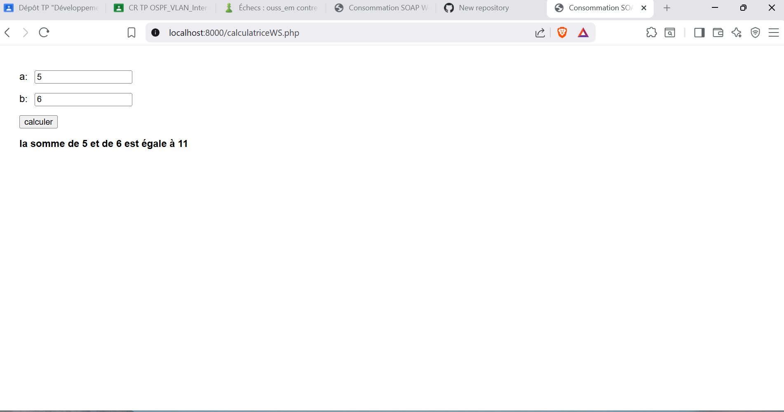

# TP 3 : Consommation d'un Service Web SOAP (Java & PHP 8)

Ce projet pratique (TP) illustre comment consommer un service web SOAP en utilisant deux approches distinctes :
1. **Client Java** avec Maven et JAX-WS.
2. **Client PHP** léger s'exécutant dans un navigateur web (consommé via Visual Studio Code et un serveur PHP local).

---

## 📸 Capture d'écran du projet en fonctionnement

Voici la démonstration du client PHP communiquant avec succès avec le service web SOAP Java pour effectuer l'addition :



---

## 🛠️ Structure du Projet

* `pom.xml` : Fichier de configuration Maven contenant les dépendances JAX-WS nécessaires (`jakarta.xml.ws-api` et `jaxws-rt`).
* `src/main/java/service/CalculatriceWS.java` : Le code source du Service Web SOAP exposant la méthode `somme(a, b)`.
* `src/main/java/service/ServeurWS.java` : Classe de publication pour démarrer le serveur SOAP localement (configuré sur le port `8081`).
* `src/main/java/client/clientwscal.java` : Classe principale du client Java consommant le service SOAP via les classes proxy générées.
* `calculatriceWS.php` : Interface HTML/PHP pour saisir deux nombres, appeler le service SOAP en arrière-plan et afficher le résultat.

---

## 🚀 Guide de Démarrage

### 1. Prérequis
* **Java SDK** (version 17 ou supérieure, testé avec OpenJDK 25).
* **PHP** (avec l'extension `soap` activée dans le fichier `php.ini`).

---

### 2. Étape 1 : Lancer le Service Web Java SOAP

Pour démarrer le service web sans serveur d'application lourd, vous pouvez directement exécuter le serveur d'écoute intégré :

1. Ouvrez le projet dans votre IDE (IntelliJ, Eclipse ou NetBeans).
2. Lancez la classe `service.ServeurWS` (`src/main/java/service/ServeurWS.java`).
3. Le serveur va démarrer et publier le WSDL à l'adresse suivante :
   `http://localhost:8081/CalculatriceWS?wsdl`

---

### 3. Étape 2 : Lancer le Client PHP

1. Ouvrez votre terminal dans le répertoire racine du projet.
2. Démarrez le serveur web PHP local :
   ```bash
   php -S localhost:8000
   ```
3. Ouvrez votre navigateur et accédez à l'adresse :
   [http://localhost:8000/calculatriceWS.php](http://localhost:8000/calculatriceWS.php)
4. Saisissez deux valeurs (ex: `5` et `6`), puis cliquez sur **Calculer** pour voir le résultat s'afficher en temps réel via SOAP !

---

### 4. Étape 3 : Lancer le Client Java

1. Générez d'abord les classes proxy à partir du WSDL (via votre outil IDE ou en utilisant l'utilitaire `wsimport`).
2. Exécutez la classe `client.clientwscal` (`src/main/java/client/clientwscal.java`).
3. Vous devriez obtenir la sortie console suivante :
   ```text
   --- SOAP Java Client ---
   The sum of 10 and 20 is: 30.0
   ```

---

## 📝 Synthèse (Takeaway)

Le protocole **SOAP** est totalement indépendant du langage de programmation. Comme il s'appuie entièrement sur des formats de données structurés en **XML** et sur un contrat d'interface standardisé (**WSDL**), un service web créé et hébergé en **Java** peut être consommé très facilement par un client écrit dans un langage complètement différent, comme un script web léger en **PHP**.
